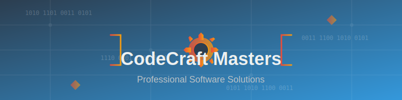
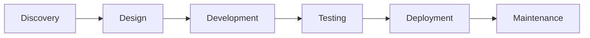

# 🚀 [CodeCraft Masters](https://nexuscode-cs.github.io)

> *Where Software Excellence Meets Innovation*

## 🎯 About Us

**CodeCraft Masters** is a premier software development company comprised of industry veterans and technical experts. We transform complex challenges into elegant digital solutions through cutting-edge technology and master-level craftsmanship.

### Our Core Competencies
- **Full-Stack Development** 🌐
- **Cloud Architecture & DevOps** ☁️
- **AI & Machine Learning** 🤖
- **Mobile Applications** 📱
- **Blockchain Solutions** ⛓️
- **Cybersecurity** 🔒
- **UX/UI Design** 🎨

## 🛠️ Technical Stack

| Domain | Technologies |
|--------|--------------|
| **Frontend** | React, Vue, Angular, TypeScript, Svelte |
| **Backend** | Node.js, Python, Go, Java, .NET, Rust |
| **Mobile** | Swift, Kotlin, React Native, Flutter |
| **Database** | PostgreSQL, MongoDB, Redis, Cassandra |
| **Cloud** | AWS, Azure, GCP, Kubernetes, Docker |
| **AI/ML** | TensorFlow, PyTorch, OpenAI, LangChain |

## 📈 Our Process

👥 Meet Our Masters

Technical Leadership

· Alex Chen - Chief Architect | 15+ years in enterprise systems
· Maria Rodriguez - Head of AI Research | PhD in Machine Learning
· James Kim - DevOps Director | Cloud infrastructure specialist
· Sarah Johnson - Security Lead | Ethical hacking & pen testing

📊 Project Portfolio

🏆 Enterprise Solutions

· Global Banking Platform - Real-time transaction processing system
· Healthcare Analytics - AI-powered patient outcome predictions
· E-commerce Scale - Platform handling 1M+ daily transactions

🎮 Innovative Products

· Smart Home OS - IoT integration platform
· AR Education Tools - Interactive learning experiences
· Blockchain Supply Chain - Transparent logistics tracking

🏢 Why Choose CodeCraft Masters?

· ✅ Proven Track Record - 200+ successful projects delivered
· ✅ Elite Talent - Top 1% software engineers worldwide
· ✅ Agile Methodology - Adaptive and transparent development
· ✅ Quality Assurance - Rigorous testing and code reviews
· ✅ 24/7 Support - Round-the-clock maintenance and monitoring

📞 Get In Touch

Contact Information

· Email: contact@codecraftmasters.dev
· Phone: +1 (555) 123-CODE
· Address: 123 Tech Innovation Drive, Silicon Valley, CA

Office Hours

· Monday - Friday: 9:00 AM - 6:00 PM PST
· Emergency Support: 24/7

🔗 Quick Links

· Our GitHub
· Case Studies
· Career Opportunities
· Technical Blog

---

💡 "We don't just write code – we engineer digital excellence"

© 2024 CodeCraft Masters. All rights reserved.

[Privacy Policy] | [Terms of Service] | [Sitemap]

